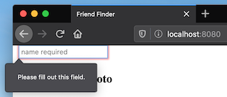

# utbc2019-hw-13-doppelganger

Find your Doppelgänger


##### Dante Gabriel Rossetti - How They Met Themselves (circa 1860-64)

## Specification

Implement a full-stack site that takes user survey results and compares those to other users' surveys to deduce and display the name and picture of the user with the most proximate responses.  

The pool of known people is represented by an in-memory array seeded by a static json file.  The array is augmented over time as the site remains operative and new users submit their responses.

This is not a full CRUD (Create, Retrieve, Update, Delete) application.  Nominally only create and retrieve are required at the record level.

## Minimal Implementation


## Technology stack

* Frontend
  * HTML, CSS
  * Object Oriented JS

* Backend
  * Node.js
  * Express.js
  * [Functional](https://github.com/zenglenn42/utbc2019-hw-13-doppelganger/blob/c096a76fe929ffb09ff0306ddaa35f57ebbd1975/app/data/survey.js#L33) JS

## Server-side cheet sheet ;-)

Refresh your brain [here](docs/notes.md).

## Designer's Blog

I know the point of this exercise is just to:

* slap together a web server
* present a form to the user
* post user data to the backend
* perform a server-side calculation
* present results to the frontend

However ...

### "There's options!"

Ajax? jQuery? Bootstrap? Templates? i18n?

These are the questions running through my mind.  It's such a simple application but I kinda want to future-proof it a bit.

I could go with a couple static html files, one for the home page, one for the survey.  The survey could hardcode a route for scoring the response data and return a match from the in-memory respondents list.

It's all very adequate and 90's-ish ... and not what I'm going to do.

### JSON-based Survey Form

Whenever I see a bunch of hardcoded HTML, it just feels wrong.  

* there's no scalability of content
* we've limited our frontend options
* we've complicated support for internationalization

So I make form construction [data driven](https://github.com/zenglenn42/utbc2019-hw-13-doppelganger/blob/c096a76fe929ffb09ff0306ddaa35f57ebbd1975/app/data/survey.js#L6), opting for some server side [HTML generation](https://github.com/zenglenn42/utbc2019-hw-13-doppelganger/blob/c096a76fe929ffb09ff0306ddaa35f57ebbd1975/app/data/survey.js#L30).

What we have now is much more of a survey /engine/ since we can add or edit the survey questions without changing any code.


Down the road (when VC clears ;-), we could easily send the raw JSON down to the frontend where it could be clothed in some spiffy [Material UI](https://material-ui.com/) components.

Interestingly, this decision steers the next.

### Ajax, bring it


Our dynamically generated form implies Ajax since, by definition, we've diverged from serving up static pages of HTML along file boundaries.

But how do we make those Ajax requests?

* old school XMLHttpRequest
* 3rd party library (like jQuery or axios)?
* Fetch api?

Strangely, I feel a bit nostalgic for the XMLHttpRequest interface in the DOM.  It's /the/ archetypal mechanism for supporting Ajax requests originating from the browser so it's now universally supported.  

Plus there are a ton of examples illustrating how to use it with RESTful verbs (GET, POST, etc).  I even wire up my frontend to the server with [XHR](https://github.com/zenglenn42/utbc2019-hw-13-doppelganger/blob/b83fa7bbb5114b53c7d286d6e50c1afb9cb16694/app/public/controller.js#L147) in a low impedance dash to get stuff communicating.

But that feels a bit too retro.  I mean there's a /reason/ why 3rd party solutions for doing Ajax manifested.

Arguably, they:

* offer simpler usage patterns
* normalize the API (if browser support diverges)

### I break with thee, jQuery (and other 3rd parties)

Despite that alure, I'm kinda not loving jQuery.  Sure, it's ruggedized and has a tasty syntax:

```
    $.get(URL,callback); 
    $.post(URL,data,callback); 
    $.ajax(url[, options])
```

I feel it sets up a slippery slope that will lure me with its siren call into DOM manipulation, complicating my efforts to leverage virtual-DOM based technologies (like [React](https://reactjs.org/)) that could improve the user experience down the road.

Who knows, maybe one day I'll feel the same way about 3rd party virtual-DOM manipulators as I do about jQuery. :D

Abandoning jQuery means I need to find an alternative to the hyper-useful:

```
    $(document).on(event, selector, callback)
```

which registers event handlers for dynamically generated DOM elements, exactly the case with our survey form.

[This will suffice](https://stackoverflow.com/questions/30880757/javascript-equivalent-to-on), though it may need to be hardened in production:

```
    delegate(el, evt, sel, handler) {
        el.addEventListener(evt, function(event) {
            let t = event.target;
            while (t && t !== this) {
            if (t.matches(sel)) {
                handler.call(t, event);
            }
            t = t.parentNode;
            }
        });
    };
```

As for axios, I've used it in other projects and it's a fine API.  But I want to stay current with browser standards (and maybe polyfill as needed).

### ["That's so Fetch"](https://media.giphy.com/media/vJ6hRee1ZlyNi/giphy.gif)

It seems like the [fetch API](https://developers.google.com/web/ilt/pwa/working-with-the-fetch-api) is the new hotness because:

* I don't have to rely on a 3rd party API.
* Browser support is decent.
* It offers a modern, promise-based, usage pattern.

It /is/ a bit weird to POST something by calling fetch, though.  Whatever, we all learned to shut down Windows by pressing start.

Happily I find [this resource](https://css-tricks.com/using-fetch/) for using fetch with non-trivial error handling.  (I weather another pang for XHR. :-/)

### Form Data Validation


While leveraging browser-supplied functionality, I employ the 'required' HTML attribute for my ```<input>``` form elements.

```
    <form id="surveyForm">
        <h1>About You</h1>
        <input name="name" type="text" required></input>
                                       --------
        <hr>
        ..
    </form>
```

Normally, this prevents the user from submitting incomplete forms to the server.  However my initial implementation defeats this desired behavior because I naively hook into the "click" event for the submit button (to bypass non-Ajaxy form processing with ACTION="```<surver-route>```").  That's enough to fool the DOM into thinking I'm going rogue and will take on all validation tasks with my custom submit handler.

The trick to get Ajax posting AND non-empty field validation by the browser is to:

* drop the ACTION="blah" METHOD="POST" form attributes
* leave the submit button alone
```
    <form id="surveyForm">
        ..
        <input type="submit" value="Submit">
    </form>
```

* register a handler for the form's 'submit' event
```
    delegate(document, "submit", "#surveyForm", postSurveyForm);
    ...
    function postSurveyForm(e) {
        e.preventDefault();
        ..
        fetch(
            "/submitSurvey.json", 
            {
                method: 'post',
                headers: {
                    'Content-Type': 'application/json'
                },
                body: JSON.stringify(formData)
            }
        ).then( response => { /* handle response */ }
        ).catch( error =>   { /* handle error */ }
        )
    }
```

Now when I try to submit with an empty input field, I'm rewarded with a bit of browser-supplied animation that guides me to the empty field:



### Modals

The specification requires us to report results in a modal window.  Since I'm going super minimal on the UI for now, I'm tempted to use a simple alert or info box from the DOM, but these only support text and I need something that will at least allow an `````` tag, if not other HTML.

I could go with a 3rd party library like sweetalerts, but I find something more spare [here](https://medium.com/@nerdplusdog/a-how-to-guide-for-modal-boxes-with-javascript-html-and-css-6a49d063987e).

The essense of the solution is to define some CSS classes and associate those with some ```<div>```'s to control visibility (and animation!).

```
    <div class="modal">
        <div class="modal-content">
            <span class="close-btn">&times;</span>
            <div id="friendResults">
            </div>
        </div>
    </div>
```

Initially we tweak the ```display``` attribute of the div:

```
    let modal = document.querySelector(".modal")
    modal.style.display = "none"
```

and then in the callback that processes results, we enable the modal:

```
    modal.style.display = "block"
```

## Next Steps

* The UI could use some improvement. ;-)
    * It would be relatively easy to leverage React and some Material UI components.
    * Add more robust form validation.
    * Use [SweetAlert](https://sweetalert.js.org/) for the modal.

* Add a database backend to persist user survey results.
    * Harden the code to catch duplicate entries.
    * Maybe implement full CRUD.

* Play with other forms of measuring compatibility.

* Spend time with friends.


