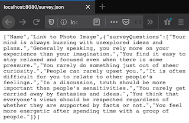

# utbc2019-hw-13-friendfinder

Find someone with similar interests.


## Technology stack

* Frontend
  * Material Design UI

* Backend
  * Node.js
  * Express.js

## Server-side cheet sheet ;-)

Refresh your brain [here](docs/notes.md).

## Add some data

To keep things simple, our friends 'database' will just be a chunk of json sitting on the server:

  [app/data/friends.js](app/data/friends.js)

and our survey will also start out as server-side json:

  [app/data/survey.js](app/data/survey.js)

## Add a simple express server and a route to serve up our survey json

```
var express = require("express");
var survey = require("./app/data/survey.js")
var app = express();
var PORT = process.env.PORT || 8080;

console.log(survey);

app.get("/", (req, res) => {
    res.writeHead(200, {"Content-Type": "text/html"});
    res.end("<h1>Welcome to Friend Finder</h1>");
})

app.get("/survey.json", (req, res) => {
    res.json(survey);
});

app.listen(PORT, () => {
    console.log(`Friend Finder server listening on port ${PORT}`);
})
```


## Add a route for sending down our home page html

```
var express = require("express");
var path = require("path");
var survey = require("./app/data/survey.js")

var app = express();
var homeHtml = "./app/public/home.html"
var PORT = process.env.PORT || 8080;

app.get("/", (req, res) => {
    res.sendFile(path.join(__dirname, homeHtml));
})

app.get("/survey.json", (req, res) => {
    res.json(survey);
});

app.get("*", (req, res) => {
    res.redirect("/");
})

app.listen(PORT, () => {
    console.log(`Friend Finder server listening on port ${PORT}`);
})
```
