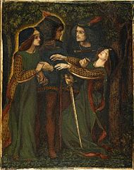
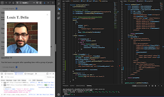

# utbc2019-hw-13-friendfinder

Find your Doppelgänger

##### Dante Gabriel Rossetti - How They Met Themselves (circa 1860-64)

## Specification

Implement a full-stack site that takes user survey results and compares them to other users to deduce and display the name and picture of the user with the best overall match.  The pool of known people is represented by an in-memory array seeded by a static json file.  The array is augmented over time as the site remains operative and new users submit their responses.

## Minimal Implementation

## Technology stack

* Frontend
  * HTML, CSS, JS

* Backend
  * Node.js
  * Express.js

## Server-side cheet sheet ;-)

Refresh your brain [here](docs/notes.md).