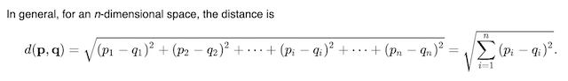

# utbc2019-hw-13-similarity-engine [(demo)](https://still-stream-71803.herokuapp.com)

Find an [L2](https://en.wikipedia.org/wiki/Euclidean_distance)-similar survey respondent.


##### Photo by 浮萍 闪电 on Unsplash

with two demo applications:


and internationalized:


... ready to monetize for your specific domain ;-)


## Technology stack

* Frontend
  * HTML, CSS
  * Object Oriented JS

* Backend
  * Node.js
  * Express.js
  * [Functional](https://github.com/zenglenn42/utbc2019-hw-13-similarity-engine/blob/c096a76fe929ffb09ff0306ddaa35f57ebbd1975/app/data/survey.js#L33) JS
  * i18n
    * Chinese
    * Spanish
    * English
    * Hindi
  * Model Analytics
    * L2 similarity

## Specification

In the beginning, there was "Friend Finder" ...

"Implement a full-stack site that takes user survey results and compares those to other users' surveys to deduce and display the name and picture of the user with the most proximate responses.  

The pool of known people is represented by an in-memory array seeded by a [static js file](https://github.com/zenglenn42/utbc2019-hw-13-similarity-engine/blob/master/app/data/respondents.js).  The array is augmented over time as the site remains operative and new users submit their responses."

It looks like this:


Very vanilla.  Very minimal.

## Data-driven Design

I decide early-on to make the user interface [data driven](https://github.com/zenglenn42/utbc2019-hw-13-similarity-engine/blob/d442fb6c55779c5ddb94c7c18864624ae8f54136/app/data/surveyBody.js#L6), opting for some server side [HTML generation](https://github.com/zenglenn42/utbc2019-hw-13-similarity-engine/blob/d442fb6c55779c5ddb94c7c18864624ae8f54136/app/routing/htmlRoutes.js#L37) from the backend.  

```
const surveyObj = {
    surveyTitle: "Survey Questions",
    formHeading: "About You",
    nameLabel: "Name",
    namePlaceholder: "name required",
    photoLabel: "Link to your photo",
    photoPlaceholder: "url required",
    minComment: "strongly disagree",
    maxComment: "strongly agree",
    questions: [
        "Your mind is always buzzing with unexplored ideas and plans.",
        "Generally speaking, you rely more on your experience than your imagination.",
        "You find it easy to stay relaxed and focused even when there is some pressure.",
        "You rarely do something just out of sheer curiosity.",
        "People can rarely upset you.",
        "It is often difficult for you to relate to other people’s feelings.",
        "In a discussion, truth should be more important than people’s sensitivities.",
        "You rarely get carried away by fantasies and ideas.",
        "You think that everyone’s views should be respected regardless of whether they are supported by facts or not.",
        "You feel more energetic after spending time with a group of people.",
    ],
    submitText: "Submit",
    resetText: "Reset"
};
```

## Internationalization

This allows me to easily support a simple form of internationalization:


by just editing two files:

* [landing page](https://github.com/zenglenn42/utbc2019-hw-13-similarity-engine/blob/a7a69c3546f9bdc4cec33ebab549ee28235d1956/app/data/homeBody.js#L19)
* [survey page](https://github.com/zenglenn42/utbc2019-hw-13-similarity-engine/blob/a7a69c3546f9bdc4cec33ebab549ee28235d1956/app/data/surveyBody.js#L34)

Integration on the frontend happens at the controller level which can be instantiated with a preferred language or modified after the fact through a ```SurveyController.setLang(lang)``` method:

```
<body>
    <div id="body-container">
    </div>
    <script type="text/javascript">
        document.addEventListener(
            "DOMContentLoaded",
            (event) => { surveyController = new SurveyController("es"); }
                                                                 ----
        );
    </script>
</body>
```
this injects a lang parameter into our query url

```
getHomeBodyHtml(callback) {
    let queryUrl = `/homeBody.html?lang=${this.lang}`
                                    -----------------
    this.getBodyHtml(queryUrl, callback)
}
```

which is interpreted by the server:

```
app.get("/homeBody.html", (req, res) => {
    let lang = req.query.lang;
    res.send(getHomeBodyHtml(getHomeBodyObj(lang)));
});
```

which performs a look-up into our various translated UI content objects:

```
const DEFAULT_LANG = "en"
const homeBodyEn = {
    title: "Friend Finder",
    callToActionShort: "Find your mental doppelgänger!",
    callToActionLong: "Answer a few basic questions then find someone among others who is closest to you in outlook.",
    buttonText: "Go to Survey"
}

const homeBodyEs = {
    title: "Buscador de Amigos",
    callToActionShort: "Encuentra tu doppelganger mental!",
    callToActionLong: "Responda algunas preguntas básicas y luego encuentre a alguien más cercano a usted en perspectiva.",
    buttonText: "Ir a la Encuesta"
}

const homeBody = {
    "en": homeBodyEn,
    "es": homeBodyEs
}

function getObj(lang = DEFAULT_LANG) {
    return (homeBody[lang]) ? homeBody[lang] : homeBody[DEFAULT_LANG];
}

module.exports = getObj;
```

## Whoa, we have a similarity engine.

Decoupling the HTML from the data required to generate our user interface opens up not only internationalization, but the possibility of serving up any multiple-choice survey.


Can I use this survey engine to find a style of dance I may want to learn?

I craft a set of multiple choice questions that relate to dance and then, taking on the persona of a specific dance, respond to the survey.  I take the survey as "Salsa" or "Waltz" and build up a pool of archetype responses.

Users who then respond similarly would be scored as having an affinity for that particular dance.  The calculation for quantifying similarity (using some simple linear algebra) is the same across domains, whether it's finding friends or finding dances.  Of course, there is probably some science and art to good archetype survey design.  But an informal demo among some dance geeks seems to serve up interesting and helpful results.

And voila ... Dance Finder is born:


With more abstraction, we could also make the similarity algorithm pluggable.  Maybe cosine distance or a hybrid combination of numerical methods is the more appropriate choice for a given survey domain.

## AJAX


Much of the content under the covers is dynamically generated (landing pages, survey forms) and is munged into a div sitting in some skeleton HTML.  Consequently, I need some Ajaxy-idiom to get that HTML.  I elect to use [fetch](https://developers.google.com/web/ilt/pwa/working-with-the-fetch-api) since it comes with the browser and is a nice, promise-based solution that avoids 3rd-party libraries like jQuery or the venerable XMLHttpRequest.

Happily I find [this resource](https://css-tricks.com/using-fetch/) for using fetch with non-trivial error handling.

Abandoning jQuery means I need to find an alternative to the hyper-useful:

```
    $(document).on(event, selector, callback)
```

which registers event handlers for dynamically generated DOM elements, exactly the case with our [survey form](https://github.com/zenglenn42/utbc2019-hw-13-similarity-engine/blob/d442fb6c55779c5ddb94c7c18864624ae8f54136/app/public/controller.js#L36).

[This will suffice](https://stackoverflow.com/questions/30880757/javascript-equivalent-to-on), though it would need to be hardened in production:

```
    delegate(el, evt, sel, handler) {
        el.addEventListener(evt, function(event) {
            let t = event.target;
            while (t && t !== this) {
            if (t.matches(sel)) {
                handler.call(t, event);
            }
            t = t.parentNode;
            }
        });
    };
```

## % Similarity

I want the number.  

Yeah, I've plugged in a similarity calculation and I'm returning the "most similar" respondent.  But /how similar/ are their survey responses to my user's responses?  I mean, if I only have one person in my pool of respondents, the app will blithely tell you this person is your best match.  Given human exhuberance, you may think they're your soulmate because you don't realize they are only 17% similar.  Are there several respondents that are 97%, 98%, 99% similar?  A decent app would maybe return multiple "highly similar" matches to give you some options in your quest for similarity.

So I take another look a the similarity calculation and deriving a % similar metric to report back to the user.  Quantified similarity would be a huge value-add and represents the model by which input data is transformed into interesting results.

The specification suggests a simple [L1 distance](https://en.wikipedia.org/wiki/Taxicab_geometry) calculation whereby a summation of deltas are calculated between the user's responses and the responsones of a pool of survey respondents.  The smallest result would be one measure of affinity between two respondents.

A brief online survey yields two other popular approaches to computing similarity, [L2](https://en.wikipedia.org/wiki/Euclidean_distance) and [cosine](https://en.wikipedia.org/wiki/Cosine_similarity).  L2 is the classic Euclidean distance formula.  If you model a completed survey as a vector, with each question corresponding to an axis in vector space, you can compute the distance between any two surveys by taking the square root of the summation of each question-response coordinate difference squared.



##### CC-SA 3.0 https://en.wikipedia.org/wiki/Euclidean_distance

### Cosine similarity fights me. :-/

The other approach is to compute the angle or, for performance reasons, the cosine of the angle between any two survey vectors.  A small angle between two survey vectors indicates an overall similarity of outlook.  A cosine close to 1 would indicate strong similarity whereas a cosine of -1 would reflect two dissimilar survey response sets.

According to literature, similarity metrics involve science and art, suggesting I may need to play with multiple methods or create a hybrid weighting of methods for reasonable results.

My initial implementation of cosine distance yields a high degree of clustering in the 90% - 98% range with test data.  I also notice a high degree of sensitivity to computed similarity when altering the responses on a single question.  I'm sad.  Intuitively, I want to see a wider spread of values and less sensitivity when altering the response to a single question or two.

### L2 similarity is good enough

I fall back on an L2 implementation but first bias the raw scores to the left so instead of values of [1 to 5] we have [-2 to 2], placing the median value at the origin.  This ensures that vectors for 'strongly agree' versus 'strongly disagree' responses have 180 degree orientations.  This method gives a nice spread of % similarity (since resultant vectors are not confined to positive space) and is less prone to wild swings in overall affinity when altering a single question's response value.  To compute % similarity I calculate the distance between the two most extreme response sets (all questions marked as 'strongly disagree' versus all marked 'strongly agree).  This maximal theoretical distance becomes my denominator while the L2 distances between my user's responses and the pool of existing responses become the numerators.  Now I have a not horrible measure of % similarity I can pass back to the user.

If I were to commercialize this code, I'd dig more deeply into the analytics or consult my awesome math friends. It seemes reasonable to make the code configurable with 'similarity scoring' functions that could be passed in for different kinds of survey data.  I also think about how different questions may actually fall along the same axis especially in psychometric data.  That should be accounted for in a more sophisticated scoring model.

For now, I'm in good enough territory.


## Style

This application is more about wiring up a Node.js Express server, adding some routes, and making requests against those routes from the frontend.  So I'm not fussing too much with the user interface.  [React](https://reactjs.org/) will wait for another day.

But there are a few choices that make the user experience not horrible. :-)

### Flexbox

I use flexbox in my css to get some easy responsiveness, organizing most content in one column of flex items with a ```main``` section that can grow and shrink, but always sticks the footer at the bottom of the browser window.

```
#body-container {
    display: flex;
    flex-direction: column;
    min-height: 100vh;
}

main {
    flex: 1;
}
```

Here's a sketch of the HTML

```
<body>
    <div id="body-container">
        <header>...</header>
        <main>...</main>
        <footer>...</footer>
    </div>
</body>
```

### Scalable Buttons


I bought the book "CSS Secrets" some time ago and love it.  Some nice fu from there is responsible for the styling on the buttons.

### Modal Results Window

If I wanted to really trick this out, I might use Sweet Alerts, but I opt for something more [spare](https://medium.com/@nerdplusdog/a-how-to-guide-for-modal-boxes-with-javascript-html-and-css-6a49d063987e).  It even includes a little animation.  So basically I just have to instrument the results div with the right modal class:

```
    <div class="modal" style="display: none;">
        <div class="modal-content">
            <span class="close-btn">&times;</span>
            <div id="results">
            </div>
        </div>
    </div>
```
and then change the display attribute when results are returned to the frontend:

```
    let modal = document.querySelector(".modal")
    modal.style.display = "block"
```

## Form Data Validation


While leveraging browser-supplied functionality, I employ the 'required' HTML attribute for my ```<input>``` form elements.

```
    <form id="surveyForm">
        <h1>About You</h1>
        <input name="name" type="text" required></input>
                                       --------
        <hr>
        ..
    </form>
```

Normally, this prevents the user from submitting incomplete forms to the server.  However my initial implementation defeats this desired behavior because I naively hook into the "click" event for the submit button (to bypass non-Ajaxy form processing with ACTION="```<surver-route>```").  Sadly, that fools the DOM into thinking I'm going rogue and will take on /all/ validation tasks with my custom submit handler.

The trick to get Ajax posting AND non-empty field validation by the browser is to:

* drop the ACTION="blah" METHOD="POST" form attributes
* leave the submit button alone
```
    <form id="surveyForm">
        ..
        <input type="submit" value="Submit">
    </form>
```

* register a handler for the form's 'submit' event
```
    delegate(document, "submit", "#surveyForm", postSurveyForm);
    ...
    function postSurveyForm(e) {
        e.preventDefault();
        ..
        fetch(
            "/submitSurvey.json", 
            {
                method: 'post',
                headers: {
                    'Content-Type': 'application/json'
                },
                body: JSON.stringify(formData)
            }
        ).then( response => { /* handle response */ }
        ).catch( error =>   { /* handle error */ }
        )
    }
```

Now when I try to submit with an empty input field, I'm rewarded with a bit of browser-supplied animation that guides me to the empty field:


## Server-side cheet sheet ;-)

* Refresh your brain [here](docs/notes.md).

# Next Steps

* The UI could use some improvement. ;-)
    * It would be relatively easy to leverage React and some Material UI components.
    * Add more robust form validation.
    * Use [SweetAlert](https://sweetalert.js.org/) for the modal.

* Add a database backend to persist user survey results.
    * Harden the code to catch duplicate entries.
    * Maybe implement full CRUD.

* Play with other forms of measuring compatibility.

* Spend time with friends.


